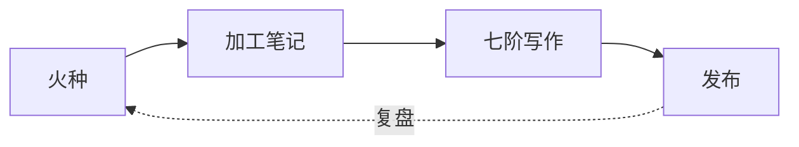

# L24 | 从散点笔记到知识网络

> [!tip] 💡 你将收获
> - 学会建 **MOC（内容地图）**，给一簇笔记建一个可导航的枢纽
> - 理解知识库的「六条设计原则」，让笔记既人好读、又 AI 好读
> - 用 Mermaid 画一张可视化的知识关系图

---

## 👀 看：从「连两条笔记」到「设计一张地图」

[[00_万法 (开箱即用·Hub)/06_课程/_课程-L05-双向链接与图谱|L05]] 教你用 `[[]]` 把两条笔记连起来、用图谱看网络。但笔记一多，你会遇到新问题：

> 「我有一堆关于『写作』的笔记，散在各处——怎么把它们组织成一个**能导航的入口**？」

答案不是再建一个文件夹（那是 L02 警告别干的事），而是建一张 **MOC（Map of Content，内容地图）**——一条「索引笔记」，用链接把同主题的笔记串起来，像目录一样一屏看完。

打开 [[00_万法 (开箱即用·Hub)/01_模板/07_进阶工具箱/模板-知识地图模板]]，它的核心就是这件事：

```
知识节点名称：____
它是什么？（一句话）→ ____
它和我已知的什么东西有关？
  连接 1：____（关系：____）
  连接 2：____（关系：____）
  连接 3：____（关系：____）
它背后的结构是什么？→ ____
它的迁移场景：→ ____
```

> [!note] 💡 课程注释
> L05 是**操作层**（怎么连），L24 是**设计层**（怎么把零散连接组织成一张可导航的地图）。知识地图模板和 MOC，干的是同一件事——给散落的笔记建一个枢纽。

---

## 🧠 解：知识网络的三种「组织姿势」

笔记多了，组织方式有三个层次（越往后越系统）：

| 层次 | 靠什么 | 适合 |
|------|--------|------|
| 1. 散点 | 啥也不做 | 刚起步 |
| 2. 链接 | `[[]]` 双链 + 图谱（L05） | 笔记间有零散关联 |
| 3. 地图 | **MOC 索引页**（本课） | 某主题笔记已经"成一簇" |

### MOC：给一簇笔记建个「枢纽」

MOC 是一条**索引笔记**：它本身没多少内容，作用是用链接把同主题的笔记串起来、分好组。比如一张「写作 MOC」：

```
# 🗺️ 写作 MOC
## 基础
- [[七阶写作法]]
- [[如何写开头]]
## 进阶
- [[AI对手盘怎么用]]
## 待写
- [[怎样结尾]]
```

打开它，整个「写作」主题一屏看完，点链接直达——**这就是知识地图模板在干的事**。

### 连接的类型（画地图时标注关系）

| 连接类型 | 例子 |
|---------|------|
| 因果 | 「A 导致了 B」 |
| 类比 | 「A 就像 B 一样」 |
| 对比 | 「A 和 B 的区别是」 |
| 层级 | 「A 是 B 的一个子集」 |
| 迁移 | 「A 的方法可以用在 B 上」 |

> [!tip] 不需要全部用到
> 上面 5 种连接类型是参考，不是清单。挑最自然的 1-2 种来用就够了——**有连接，比连接的类型更重要**。

---

## 🔨 做：建你的第一张 MOC 知识地图

### Step 1｜挑一个「成一簇」的主题

翻图谱（L05）或搜索（L04），找一个笔记已经扎堆的主题（如「写作」「复盘」「Obsidian」）。

### Step 2｜用知识地图模板建一张 MOC

在 `20_二旋 (磨一磨·Lab)` 新建笔记（建议命名 `MOC-主题名`），套用知识地图模板，把该主题的笔记用 `[[]]` 串起来，按子主题分组（参考上面「写作 MOC」）。

### Step 3｜（进阶）用 Mermaid 画一张关系图

在 MOC 里嵌一个 Mermaid 流程图，把知识点的关系画出来（Obsidian 原生支持，不用装插件）：

````markdown

````

想画手绘风格的白板图？装 **Excalidraw** 插件，自由拖拽节点连线。

### Step 4｜找到迁移场景

对每个核心知识点问：「这个方法还能用在什么场景？」——迁移场景越多，这个知识点越值钱。

> [!check] ✅ 验证清单
> - [ ] 挑了一个「成一簇」的主题
> - [ ] 建了一张 MOC，用 `[[]]` 串起 5+ 篇笔记并分组
> - [ ]（可选）嵌了一张 Mermaid 关系图
> - [ ] 找到了至少 1 个迁移场景

---

## 🎯 变：让知识库「AI 友好」

| 场景 | 怎么用 |
|------|--------|
| 写系列文章 | 先画 MOC，再按连接顺序写 |
| 学新领域 | 把新知识点和已知的连进 MOC |
| 教别人 | MOC 就是你的教学大纲 |
| AI 对话 | 把 MOC 喂给 AI，让它发现盲区 |

### 知识库设计的六条原则（让笔记「人好读」又「AI 好读」）

在 AI 时代，知识库不只是"仓库"，而是你的"思维上下文引擎"——设计得好，AI（L23 的 Copilot / Vault QA）才能读懂你。六条原则：

> [!example] 🏗️ 六条设计原则速查
> | 原则 | 一句话 | 在本仓库怎么做 |
> |------|--------|---------------|
> | 原子化 | 一张卡只讲一个概念 | 费曼卡一卡一概念（L20） |
> | 上下文化 | 记下"我为什么记它" | 模板里的「我的思考」字段 |
> | 链接化 | 每个概念至少链 2 个相关 | `[[]]` + MOC |
> | 结构化 | 用 frontmatter 标记 | 每篇都有 `tags` / `status` |
> | 可迁移 | 纯 Markdown，不锁平台 | 本仓库全是 `.md` |
> | 开放性 | 设计"能被读取"的入口 | MOC 索引 + Dataview 查询 |
>
> 💡 前 5 条本仓库**天然满足**（五区 + 模板 + frontmatter）。你只需持续做第 6 条——用 MOC 和 Dataview 给笔记建"可被查询的入口"。

> [!tip] 延伸阅读
> - [[00_万法 (开箱即用·Hub)/01_模板/07_进阶工具箱/模板-知识地图模板|知识地图模板]]
> - [[00_万法 (开箱即用·Hub)/01_模板/07_进阶工具箱/模板-能力迁移思考框架|能力迁移框架]] — 把一个能力迁移到十个场景

---

## ➡️ 下一课预告

Tier 2 的能力你基本集齐了。进入最后阶段前，先点亮一个把所有系统**可视化、自动化**的杀手级插件——**Dataview**。它能让你的笔记自动生成仪表盘、动态汇总，是从「手动整理」升级到「系统自动运转」的关键一跃。

→ [[00_万法 (开箱即用·Hub)/06_课程/_课程-L25-Dataview入门|L25：让笔记变成动态数据库]]
